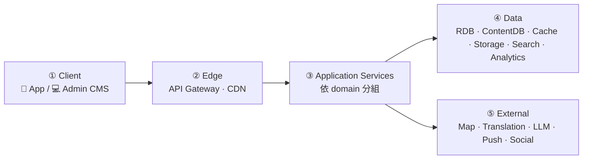
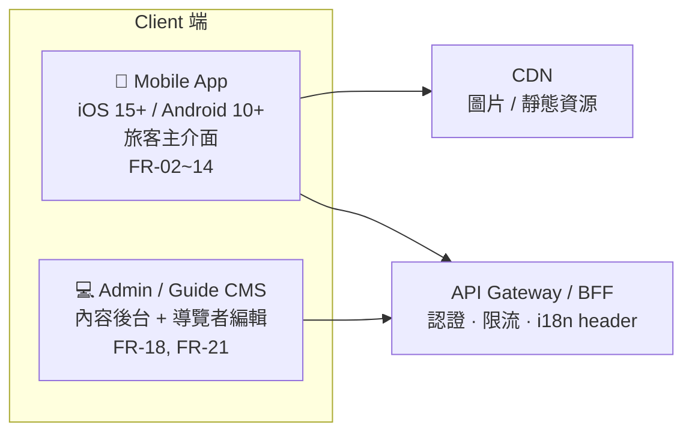
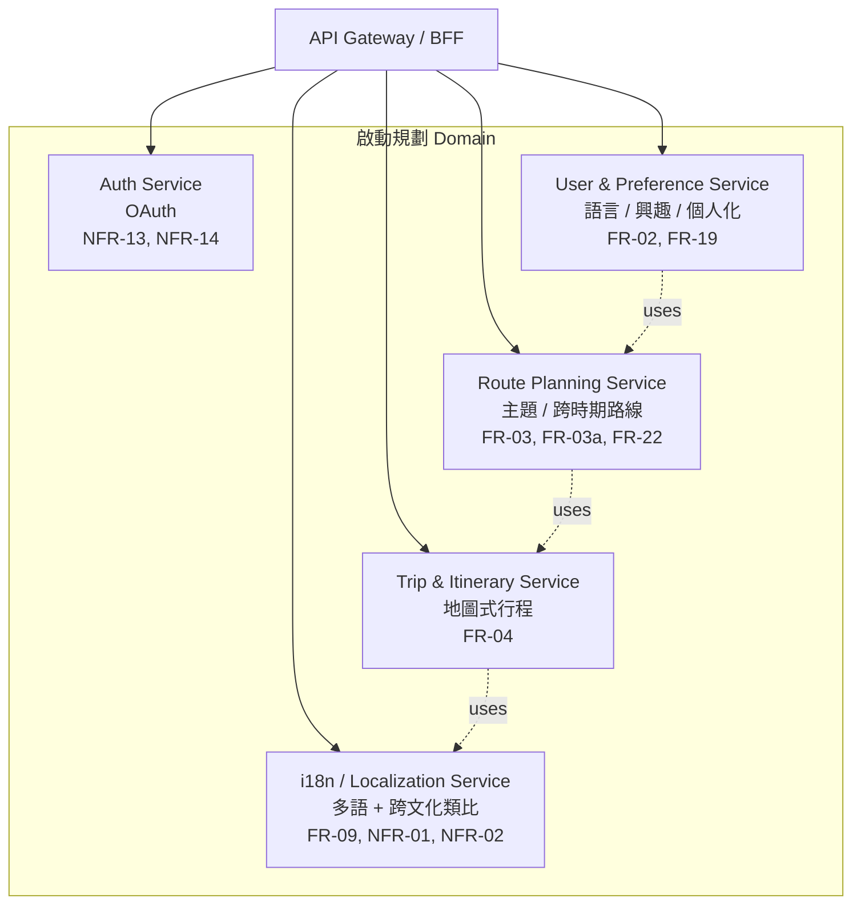
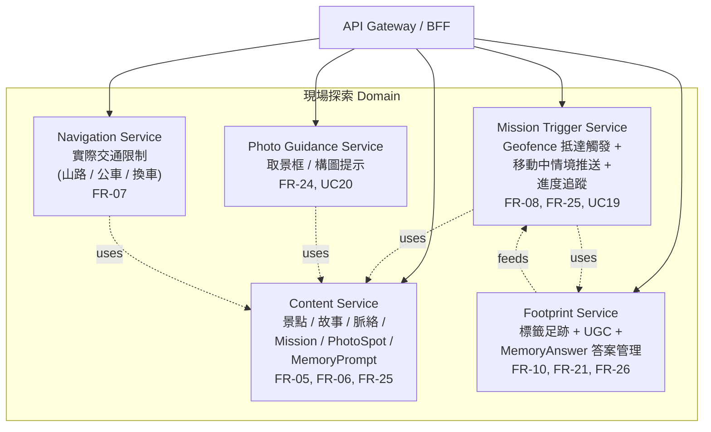
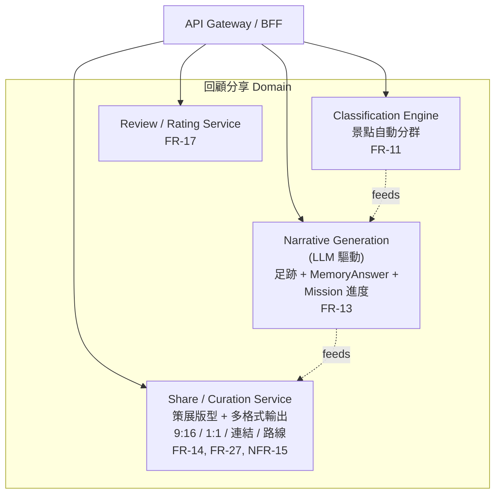
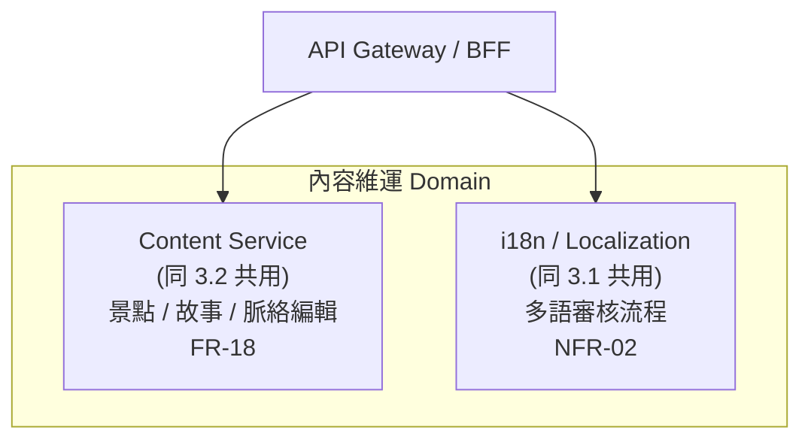
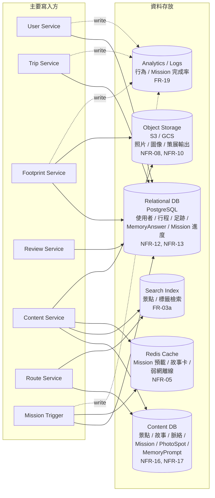
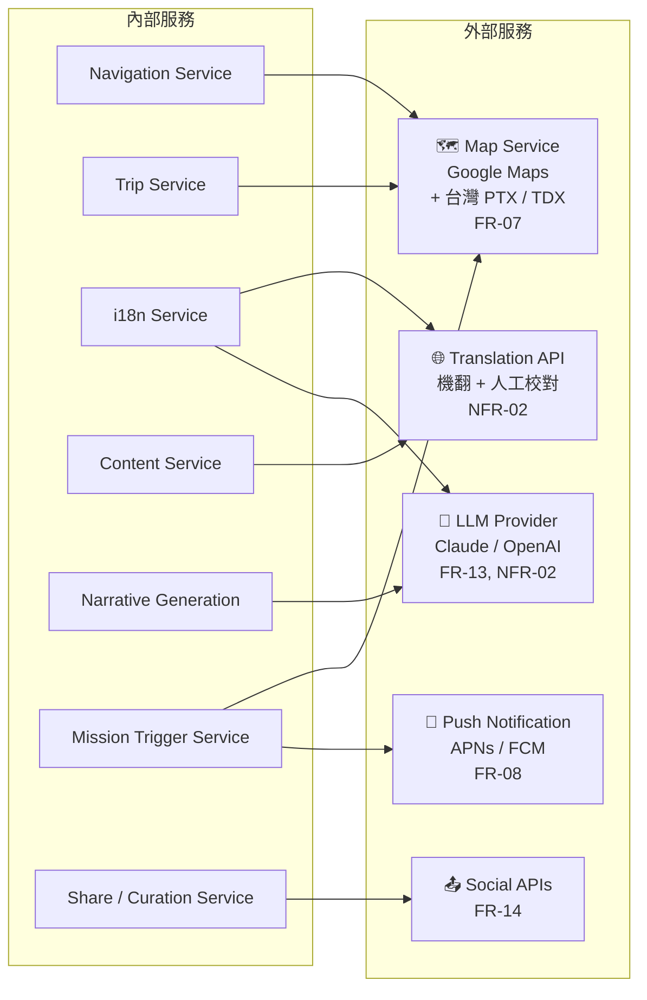
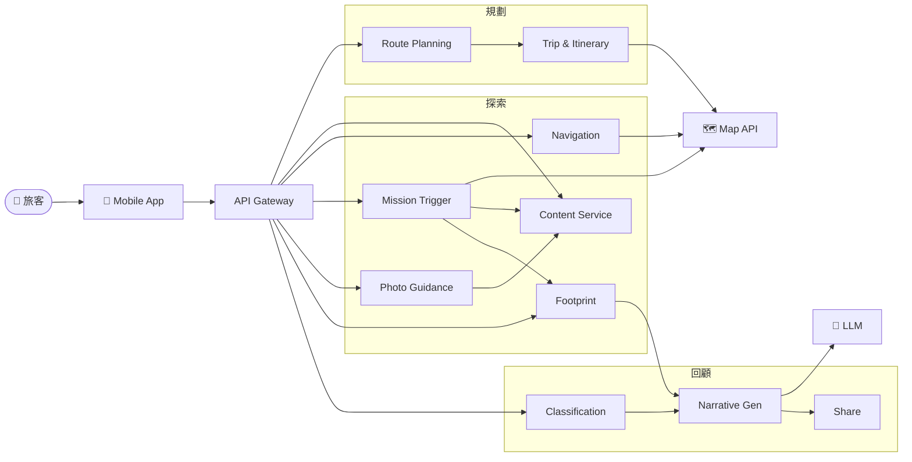

# 系統架構圖 (System Architecture)

> 專案:外國旅客在台灣初期探索文化的體驗設計
> 主要 Persona:深度記錄型外國旅客(requirements.md §1.1)
> 來源:`requirements.md`(FR-02 ~ FR-27 缺 FR-01/15/16/20/23、UC2 ~ UC22 缺 UC1/14/15、NFR-01 ~ NFR-20)
> 目的:概覽本專案會用到的 service 類型與彼此關係,作為實作前的技術藍圖。

為避免單張圖過於擁擠,以下拆成 **6 張小圖**:
1. 高階總覽
2. Client 端
3. 應用服務(依旅客旅程拆 4 個 domain group)
4. 資料層
5. 外部服務整合
6. 端到端資料流(以「規劃 → 探索 → 回顧」為例)

---

## 1. 高階總覽 (High-Level Overview)

只看「層」與「層之間的方向」,先建立心智模型。

> 後續各小節會把 ③ 應用服務逐塊放大。

---

## 2. Client 端

對應 NFR-20。兩種前端,共用後端 API。

---

## 3. 應用服務 (Application Services)

14 個服務,依旅客旅程拆成 4 個 domain group:**啟動規劃 / 現場探索 / 回顧分享 / 內容維運**。

### 3.1 啟動規劃 Domain (Onboarding & Planning)

對應 UC2、UC4、UC5、UC13。

### 3.2 現場探索 Domain (On-site Exploration)

對應 UC3、UC6、UC7、UC8、UC19、UC20、UC21。

### 3.3 回顧分享 Domain (Review & Share)

對應 UC9、UC10、UC11、UC12、UC22。

### 3.4 內容維運 Domain (Content Operations)

對應 UC16、UC17、UC18。

> Content Service 與 i18n Service 同時被旅客端與後台共用,故跨 domain 出現。

---

## 4. 資料層 (Data Layer)

哪些 service 寫到哪些 store?以「資料種類」分類。

---

## 5. 外部服務整合 (External Integrations)

哪些 service 對接哪些外部 API。

> MissionSvc 依賴 MapAPI 計算 geofence(進入古蹟範圍判斷),並透過 PushSvc 觸發 Heritage Mission 入口通知。

---

## 6. 端到端資料流(以「規劃 → 探索 → 回顧」為例)

把跨 domain 的呼叫串成一條線,看請求如何流動。

---

## 7. 主要 service 用途速查

| 類別 | Service | 用途 | 對應 FR/NFR |
|---|---|---|---|
| **Client** | Mobile App | 旅客主介面 | FR-02~14, NFR-20 |
| | Admin CMS | 內容後台與導覽者編輯 | FR-18, FR-21 |
| **Edge** | API Gateway / BFF | 統一入口、認證、語系 header | NFR-13, NFR-19 |
| | CDN | 多語靜態資源 | NFR-03, NFR-08 |
| **App** | Auth Service | 登入 + Role | NFR-13, NFR-14 |
| | User & Preference | 語言、興趣、個人化 | FR-02, FR-19 |
| | Content Service | 景點 / 故事 / 脈絡 / Mission / PhotoSpot / MemoryPrompt | FR-05, FR-06, FR-18 |
| | Route Planning | 主題 / 跨時期路線 | FR-03, FR-03a, FR-22 |
| | Trip & Itinerary | 地圖式行程 | FR-04 |
| | Navigation Service | 實際交通限制處理 | FR-07 |
| | Footprint Service | 標籤足跡 + UGC + MemoryAnswer | FR-10, FR-21, FR-26 |
| | Classification Engine | 景點自動分群 | FR-11 |
| | Narrative Generation | LLM 旅程敘事(吃 MemoryAnswer + Mission 進度) | FR-13 |
| | Mission Trigger Service | Geofence 抵達觸發 + 移動中推送 + 進度追蹤 | FR-08, FR-25 |
| | Photo Guidance Service | 取景框 / 構圖提示 | FR-24 |
| | Share / Curation Service | 多形式分享 + 策展版型(明信片/時間軸/故事書) | FR-14, FR-27, NFR-15 |
| | i18n / Localization | 多語 + 跨文化類比 | FR-09, NFR-01, NFR-02 |
| | Review / Rating | 景點評分 | FR-17 |
| **Data** | PostgreSQL | 使用者 / 行程 / 足跡 | NFR-12, NFR-13 |
| | Content DB | 景點 / 故事 / 脈絡 | NFR-16, NFR-17 |
| | Redis Cache | 故事卡 / 弱網離線 | NFR-05, NFR-12 |
| | Object Storage | 照片 / 圖像 | NFR-08, NFR-10 |
| | Search Index | 景點 / 標籤檢索 | FR-03a |
| | Analytics | 行為與推薦訓練 | FR-19 |
| **External** | Map Service | 路徑、位置、實際交通 | FR-07, NFR-04 |
| | Translation API | 多語翻譯 | NFR-02 |
| | LLM Provider | 敘事 / 文化類比 | FR-13, NFR-02 |
| | Push Notification | 故事卡推送 | FR-08 |
| | Social / Messaging | 分享渠道 | FR-14 |

---

## 8. 四個關鍵差異化 service

從整體架構中,以下四個是「跟既有工具(Google Maps / 去去 / 一般打卡 App)區隔」的核心,實作優先級最高。

| Service | 為何關鍵 | 依賴 |
|---|---|---|
| **Mission Trigger + Photo Guidance** | refactor.md 的核心體驗 — 抵達古蹟自動觸發 Heritage Mission、依 Suggested Shot 引導拍攝、Memory Prompt 收集反思,完成「省力高質感分享」與「尋求意義」兩大 Persona 需求(FR-05, FR-08, FR-24, FR-25, UC19-21) | Map API geofence、Push Notification、Content Service |
| **Narrative Generation + LLM** | 不是把 footprint 串成清單,而是依文化脈絡 + MemoryAnswer + Mission 進度「重新敘述」這趟旅程,讓使用者的個人聲音被放大(FR-13) | LLM Provider、Footprint、Content Service |
| **Share / Curation Service** | 不是單一分享按鈕,而是多版型(明信片/時間軸/故事書)+ 多格式輸出,對應 Persona「策展式自我表達」(FR-14, FR-27) | Narrative Generation、Object Storage、Social API |
| **Navigation + Map API** | 不是 Google Maps 點對點,而要結合台灣 PTX / TDX 處理山路、公車、換車(FR-07) | Google Maps、PTX / TDX |

---

## 9. 部署與技術選型建議

> 此處為依需求規模的合理建議,實作時可依團隊熟悉度調整。

| 層級 | 建議 | 理由 |
|---|---|---|
| 行動端 | React Native 或原生(Swift / Kotlin) | 離線優先(NFR-12)、原生地圖與位置觸發 |
| 後端 | 模組化單體 → 漸進拆分微服務 | MVP 集中迭代,服務邊界先在程式內劃清 |
| 後端語言 | Node.js / Go / Python | Python 對 LLM 整合較順 |
| 關聯式 DB | PostgreSQL | 行程、足跡、評論需強一致性 |
| 內容 DB | PostgreSQL / MongoDB / Strapi headless | App 與後台解耦(NFR-16) |
| 快取 | Redis | 故事卡預載、弱網離線(NFR-05) |
| 物件儲存 | S3 / GCS + CDN | 高品質圖像(NFR-08) |
| LLM | Anthropic Claude / OpenAI | 敘事 + 跨文化類比(NFR-02) |
| 地圖 | Google Maps + 台灣 PTX / TDX | 補強山路、公車、換車(FR-07) |
| 推播 | APNs / FCM | 移動中故事卡(FR-08) |
| 觀測性 | Sentry + Datadog / Grafana | 99.5% 可用度(NFR-11) |
| 部署 | Cloud Run / ECS / Kubernetes | MVP 階段先單一 region |
| MVP 範圍 | **台南單城市** | NFR-18 — 先驗證再擴張全台 |
