# 系統設計圖 (Diagrams)

> 專案:外國旅客在台灣初期探索文化的體驗設計
> 主要 Persona:深度記錄型外國旅客(requirements.md §1.1)
> 來源:`requirements.md`(FR-02 ~ FR-27 缺 FR-01/15/16/20/23、UC2 ~ UC22 缺 UC1/14/15)
> 內容:Activity Diagram、Domain Class Diagram、System Sequence Diagram (SSD)

---

## 1. Activity Diagrams

依旅客旅程的四個主要階段(啟動 / 規劃 / 探索 / 回顧)與內容維運流程,共繪製 5 張 activity diagram。

### 1.1 啟動與興趣設定 (Onboarding)

對應 UC2、UC13,以及 FR-02、FR-09。

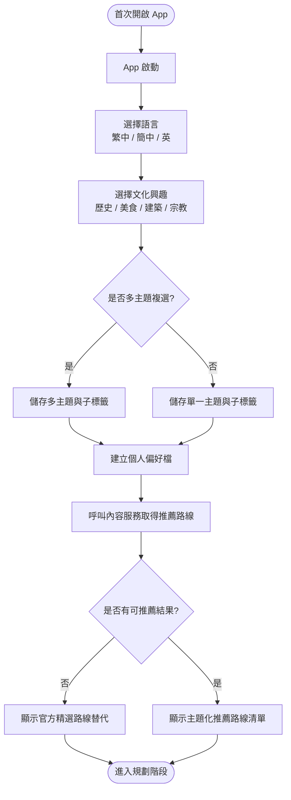

---

### 1.2 行程規劃 (Trip Planning)

對應 UC4、UC5,以及 FR-03、FR-03a、FR-04、FR-19、FR-22。

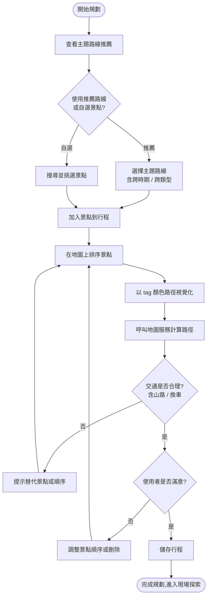

---

### 1.3 現場探索與 Heritage Mission (On-site Exploration)

對應 UC3、UC6、UC7、UC8、UC19、UC20、UC21,以及 FR-05、FR-06、FR-07、FR-08、FR-10、FR-24、FR-25、FR-26。

```mermaid
flowchart TD
    Start([啟程前往景點]) --> E1[App 取得目前位置]
    E1 --> E2[計算導航至下一景點]
    E2 --> E3{移動中經過<br/>其他文化景點?}
    E3 -- 是 --> E4[推送輕量情境卡<br/>例如『此處為赤崁樓』]
    E3 -- 否 --> E5{進入古蹟<br/>地理範圍?}
    E4 --> E5
    E5 -- 否 --> E2
    E5 -- 是 --> M1[Mission Trigger:<br/>推送 Heritage Mission 入口]
    M1 --> M2[顯示 Mission 結構:<br/>X 個必拍 photo spot,進度 Y/X]
    M2 --> M3{選擇 photo spot}
    M3 --> M4[顯示 Story Line 三件套:<br/>Suggested Shot / Why Special /<br/>Memory Prompt]
    M4 --> M5[顯示取景框 overlay<br/>+ 構圖提示]
    M5 --> M6{拍照?}
    M6 -- 是 --> M7[拍攝並附掛至 photo spot]
    M6 -- 否(略過) --> M11
    M7 --> M8{填寫 Memory Prompt?<br/>(選填,鼓勵)}
    M8 -- 填 --> M9[儲存 MemoryAnswer]
    M8 -- 跳過 --> M10[僅儲存照片 + 標籤]
    M9 --> M11[更新 Mission 進度]
    M10 --> M11
    M11 --> E7{是否查看脈絡關聯<br/>(與前後景點)?}
    E7 -- 是 --> E8[顯示時代 / 宗教 / 功能差異]
    E7 -- 否 --> M12{所有 photo spot 完成?}
    E8 --> M12
    M12 -- 否,繼續 --> M3
    M12 -- 部分/全部完成 --> E15{行程結束?}
    E15 -- 否 --> E2
    E15 -- 是 --> End([進入回顧階段])
```

> 重點:Mission 不強制完成所有 photo spot,只完成 1/3 仍可登記為「造訪過」並進入下個景點(對應 FR-25 + Persona「省力」需求);Memory Prompt 全程選填,但填寫後可被 FR-13 敘事生成優先引用。

---

### 1.4 旅程回顧與策展分享 (Review & Curate)

對應 UC9、UC10、UC11、UC12、UC22,以及 FR-11、FR-12、FR-13、FR-14、FR-26、FR-27。

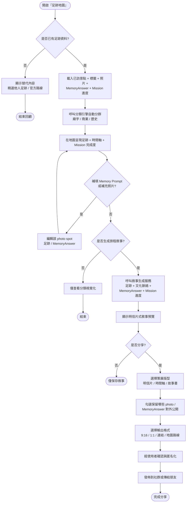

---

### 1.5 內容維運與 UGC 標籤審核 (Content Management)

對應 UC16、UC17、UC18,以及 FR-18、FR-21。

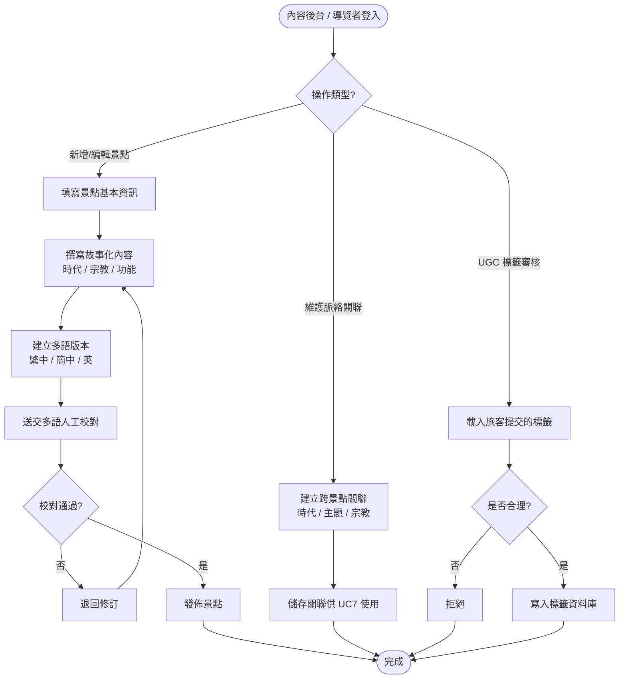

---

## 2. Domain Class Diagram

依需求文件提取核心 domain 實體與其關聯。涵蓋使用者、興趣偏好、景點與故事、標籤層次、路線與行程、足跡與敘事、商家合作、多語內容等。

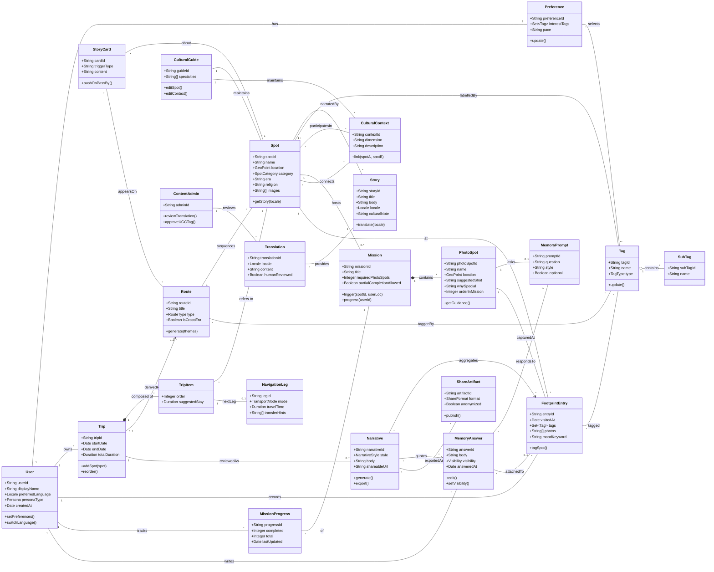

> 列舉值說明
> - `Persona`: DEEP_DOCUMENTER (主要 — 深度記錄型) / CASUAL_TRAVELER (依行為而非國籍)
> - `TagType`: THEME (歷史/美食/建築/宗教) / SUBTHEME (小吃/甜點/熱門…)
> - `SpotCategory`: TEMPLE / HISTORICAL / COMMERCIAL / FOOD / ARCHITECTURE
> - `RouteType`: SAME_THEME / CROSS_ERA / CROSS_CATEGORY
> - `TransportMode`: WALK / BUS / TRAIN / MOUNTAIN_ROAD / SHUTTLE
> - `NarrativeStyle`: POSTCARD / TIMELINE / STORYBOOK
> - `ShareFormat`: LINK / IMAGE_9_16 / IMAGE_1_1 / SOCIAL_POST / MAP_ROUTE
> - `MemoryPromptStyle`: REFLECTIVE (如「若你生於那時代…」) / SENSORY (氣味/聲音記憶) / COMPARATIVE (與家鄉對比)
> - `Visibility`: PRIVATE / SHARED_WITH_NARRATIVE / PUBLIC

---

## 3. System Sequence Diagrams (SSD)

SSD 將整個系統視為單一黑盒,只描繪「外部 actor 與系統」之間的訊息往返,聚焦於每個 use case 的關鍵互動。

### 3.1 SSD-1:啟動 → 取得首條推薦路線

對應 UC2、UC13、UC5(NFR-06:3 步以內)。

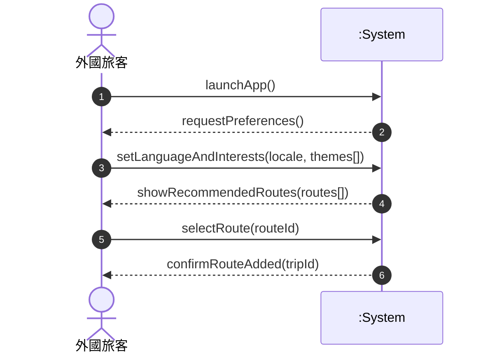

---

### 3.2 SSD-2:地圖式行程規劃

對應 UC4;FR-03、FR-04。

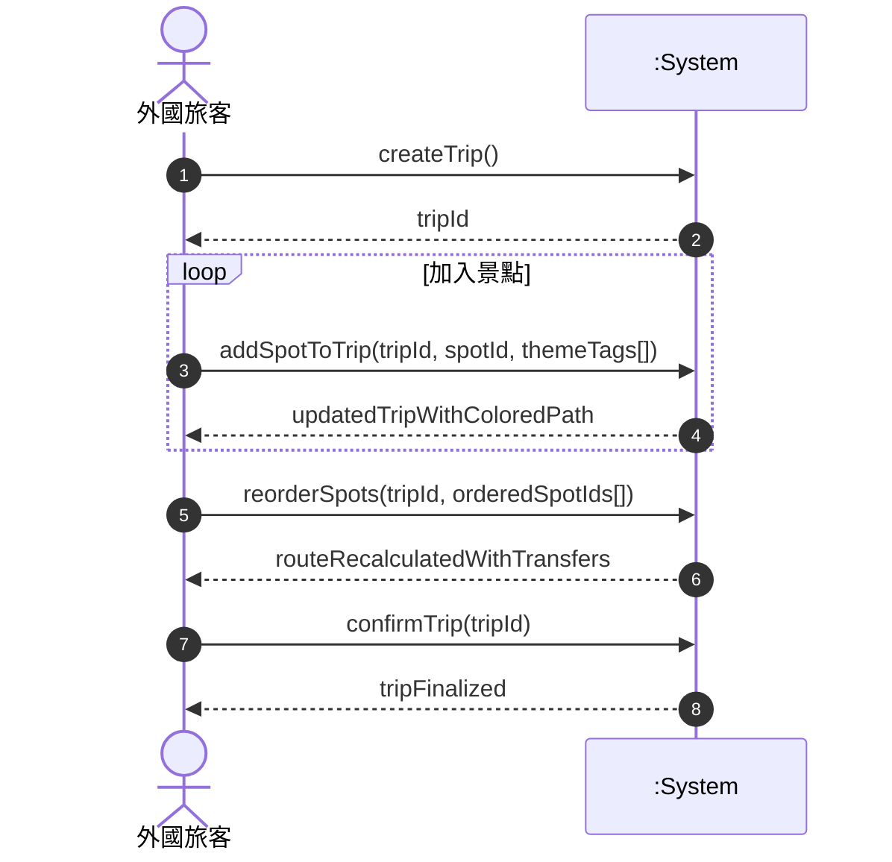

---

### 3.3 SSD-3:Heritage Mission 觸發與 Story Line 三件套

對應 UC3、UC6、UC7、UC8、UC19、UC20、UC21;FR-05、FR-06、FR-08、FR-10、FR-24、FR-25、FR-26。

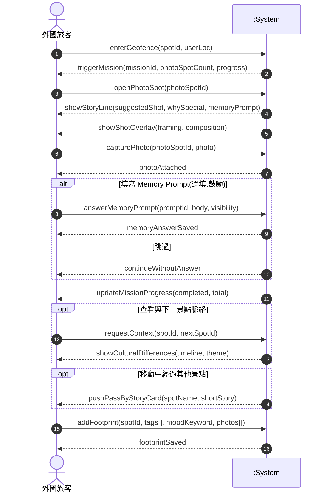

> Mission 不要求完整完成所有 photo spot — 即使 1/3 也視為造訪;但 FR-13 敘事生成會把已填寫的 MemoryAnswer 與 Mission 進度作為個人化素材的優先來源。

---

### 3.4 SSD-4:旅程回顧、敘事生成與策展分享

對應 UC9、UC10、UC11、UC12、UC22;FR-11、FR-12、FR-13、FR-14、FR-26、FR-27。

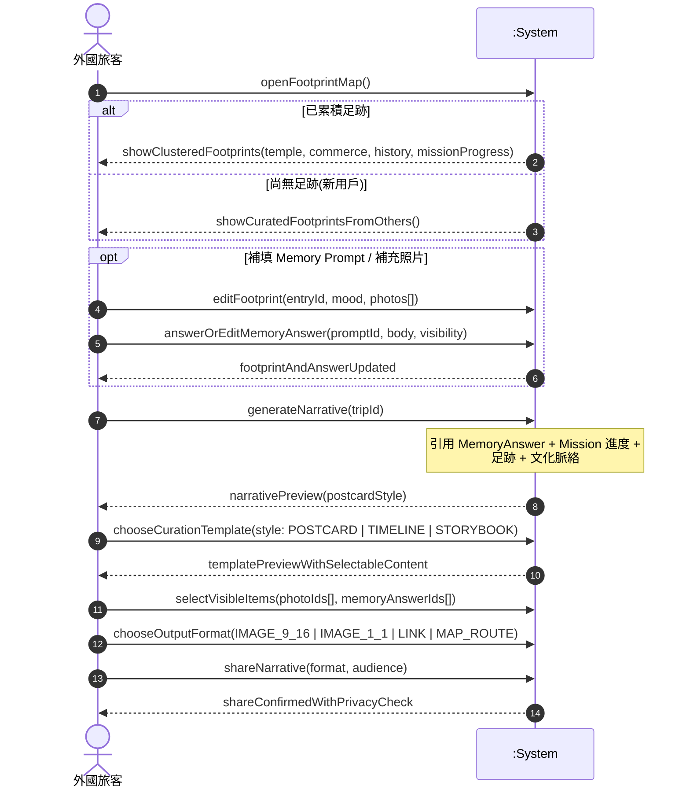

---

### 3.5 SSD-5:內容後台 — 維護景點與多語審核

對應 UC16、UC17、UC18;FR-18、NFR-01、NFR-02。

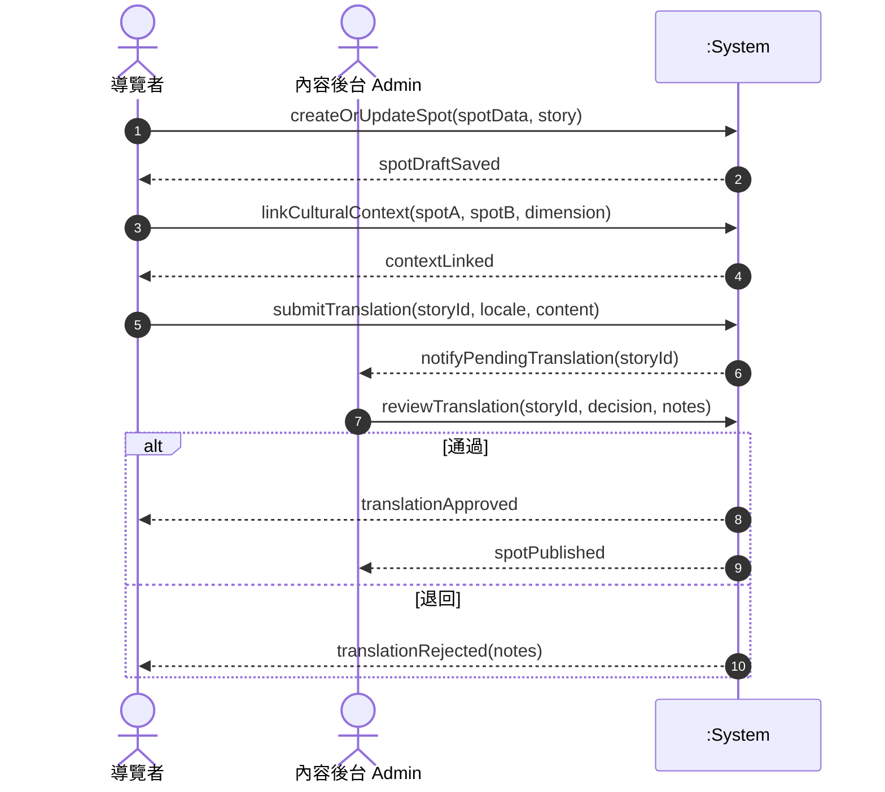

---

### 3.6 SSD-6:UGC 標籤協作與審核

對應 UC8 延伸 + FR-21。

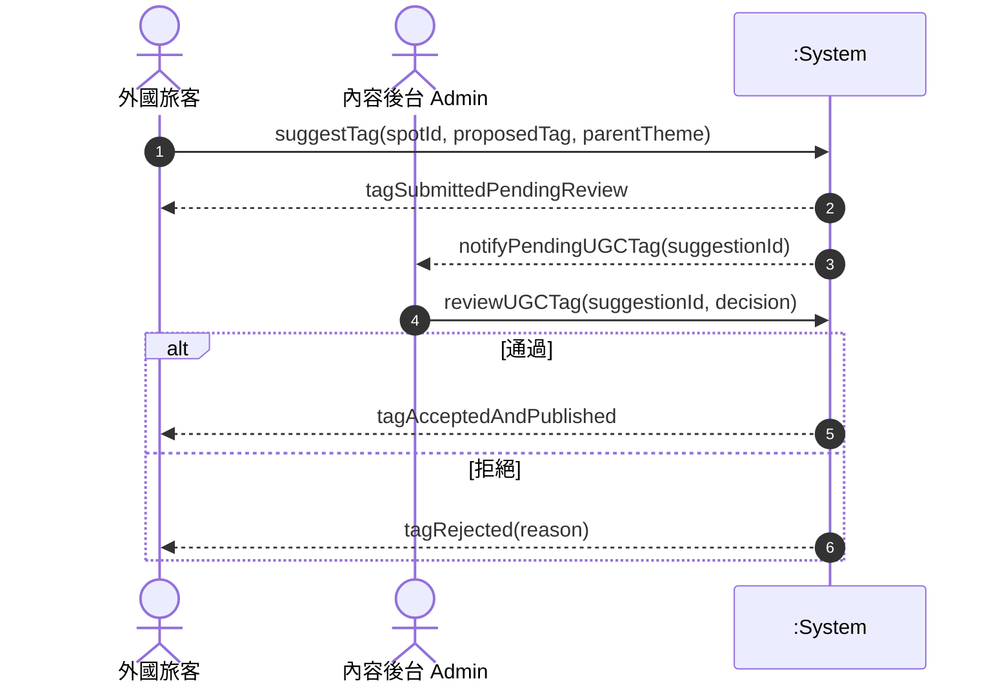

---

## 4. 圖表與需求對照表

| 圖表 | 對應 Use Case | 對應 Functional Requirement |
|---|---|---|
| Activity 1.1 啟動與興趣設定 | UC2, UC13 | FR-02, FR-09 |
| Activity 1.2 行程規劃 | UC4, UC5 | FR-03, FR-03a, FR-04, FR-19, FR-22 |
| Activity 1.3 現場探索與 Mission | UC3, UC6, UC7, UC8, UC19, UC20, UC21 | FR-05, FR-06, FR-07, FR-08, FR-10, FR-24, FR-25, FR-26 |
| Activity 1.4 回顧與策展分享 | UC9, UC10, UC11, UC12, UC22 | FR-11, FR-12, FR-13, FR-14, FR-26, FR-27 |
| Activity 1.5 內容維運 | UC16, UC17, UC18 | FR-18, FR-21, NFR-02 |
| Domain Class Diagram | 全部 | FR-02 ~ FR-27(資料模型支撐) |
| SSD-1 啟動 | UC2, UC13 | FR-02, NFR-06 |
| SSD-2 行程規劃 | UC4 | FR-03, FR-04 |
| SSD-3 Mission 觸發與三件套 | UC3, UC6, UC7, UC8, UC19, UC20, UC21 | FR-05, FR-06, FR-08, FR-10, FR-24, FR-25, FR-26 |
| SSD-4 回顧敘事與策展 | UC9, UC10, UC11, UC12, UC22 | FR-11, FR-12, FR-13, FR-14, FR-26, FR-27 |
| SSD-5 內容維運 | UC16, UC17, UC18 | FR-18, NFR-01, NFR-02 |
| SSD-6 UGC 標籤 | (UC8 延伸) | FR-21 |
