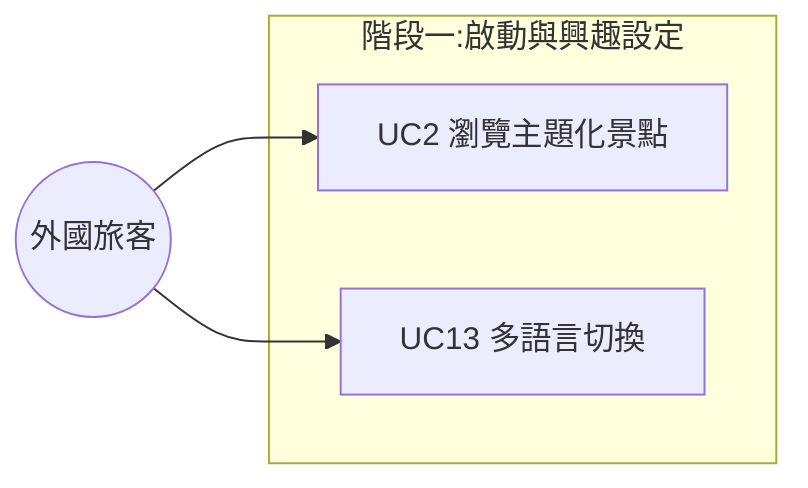
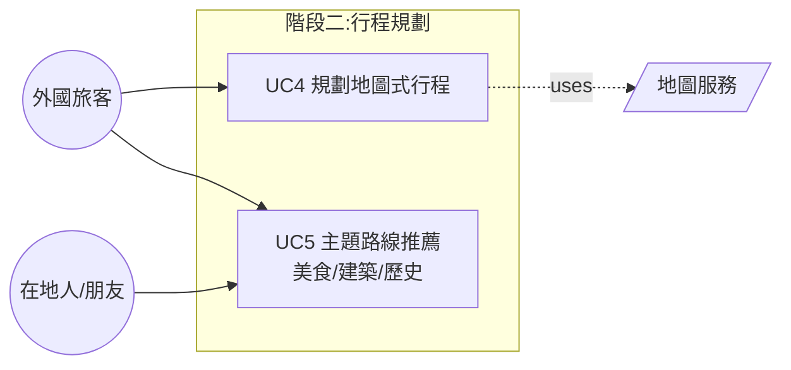
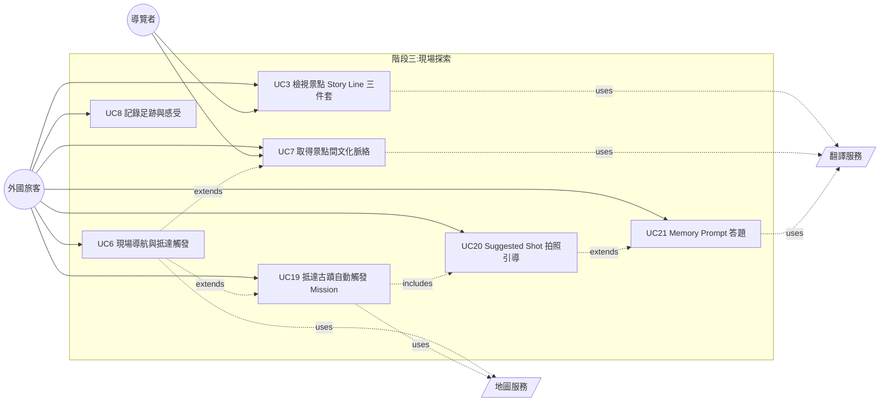
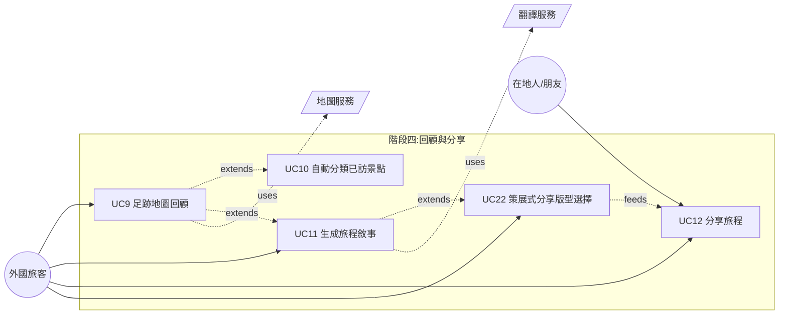
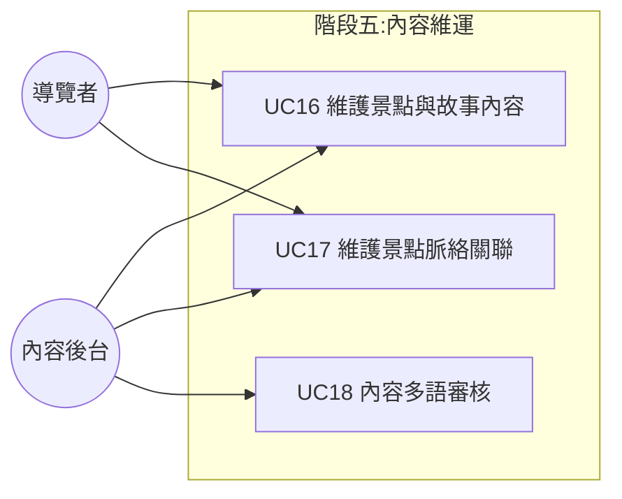
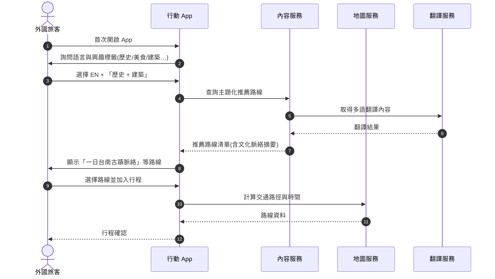
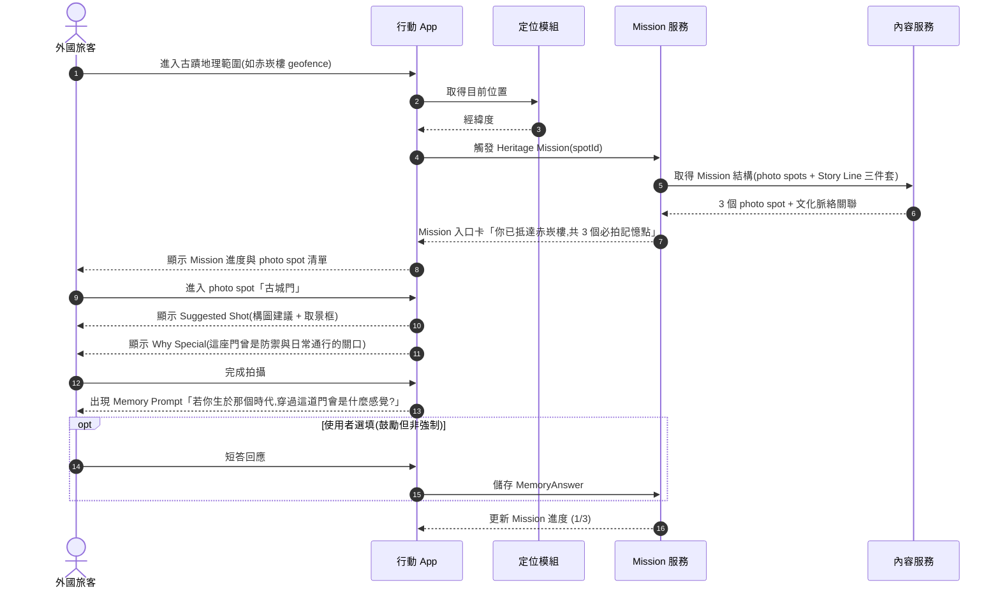
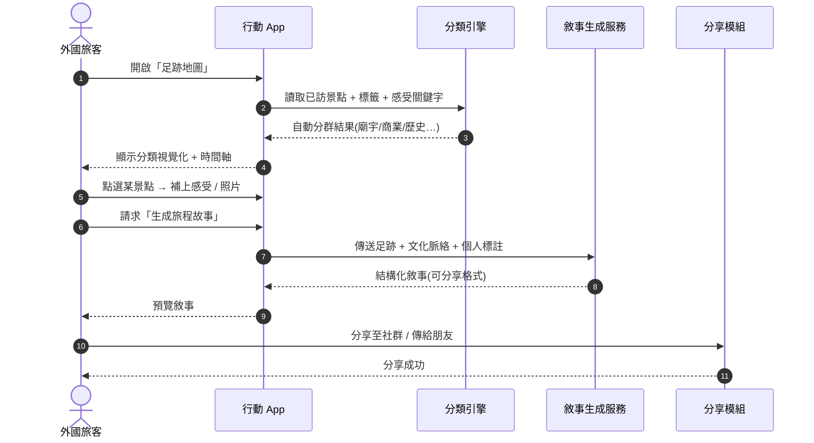

# 系統需求文件

> 專案:外國旅客在台灣初期探索文化的體驗設計
> 來源報告:`report.md`(期中報告)
> 設計核心:重新設計「文化被理解的方式」— 解決資訊存在卻無法被連結與理解的問題,並讓**深度記錄型旅客**能省力產出具意義的高品質分享內容。

---

## 1. 系統概述 (System Overview)

針對外國自由行旅客(尤其非中文母語者)從**抵達 → 城市探索 → 景點參觀 → 旅程回顧 → 分享**的完整路徑,提供:

- 結構化、故事化的台灣文化內容
- 主題化路線(美食、建築、歷史等)與地圖式行程規劃
- **抵達古蹟即觸發的 Heritage Exploration Mission**:以「Suggested Shot / Why Special / Memory Prompt」三件套引導拍攝與意義建構
- 旅程後的足跡回顧、敘事生成,以及策展式分享版型

### 1.1 Target Persona — 深度記錄型外國旅客

> Persona 為原「外國旅客」母集中的**主要 segment**,而非取代;Casual 旅客仍是次要使用者。多語仍為第一優先(NFR-01、NFR-02)。

| 特徵 | 設計意涵 | 對應需求 |
|---|---|---|
| **記憶保存的深層需求** — 認為照片只是片段,故事才是真正的記憶 | 每個 photo spot 需提供「Why Special」與「Memory Prompt」,讓使用者在現場留下個人化註記,而非只儲存照片 | FR-05、FR-13、FR-26 |
| **省力高質感悖論** — 想分享精緻內容但不願花長時間製作 | 系統提供拍攝引導(構圖、視角、Suggested Shot)、Memory Prompt 短答題,與一鍵生成策展式分享版型 | FR-13、FR-14、FR-24、FR-27 |
| **尋求意義而非打卡** — 旅程要有反思與連結 | Heritage Mission 與跨景點脈絡(FR-06)結合,讓拍照行為帶有歷史與情感意義,而非單一打卡 | FR-05、FR-06、FR-13 |
| **策展式自我表達** — 透過旅程展現品味與生活風格 | 分享版型需支援多種風格(明信片、時間軸、故事書),並可由使用者選擇保留哪些 Memory Prompt 回答 | FR-13、FR-14、FR-27 |

---

## 2. Actors

| Actor | 說明 |
|---|---|
| **外國旅客 (Foreign Tourist)** | 主要使用者,通常為非中文母語者。**主要 segment 為「深度記錄型旅客」**(§1.1):重視記憶保存、追求省力高質感分享、尋求意義而非打卡、以旅程展現個人品味。Casual 旅客為次要 segment。Persona 依行為模式而非國籍拆解,具相同需求的本地人亦屬此類。(逐字稿 00:20:06–00:21:15 Speaker 8) |
| **在地人 / 朋友 (Local Resident)** | 陪同旅客探索,提供推薦與分享。 |
| **導覽者 / 文化工作者 (Cultural Guide)** | 推廣在地文化,需依對象調整內容深度。 |
| **內容後台 (Content Admin)** | 維護景點、故事、文化脈絡資料。 |
| **地圖服務 (Map Service)** | 外部系統,提供導航與位置。 |
| **翻譯服務 (Translation Service)** | 外部系統,提供多語轉譯。 |

---

## 3. Use Case List

| ID | Use Case | 主要 Actor | 階段 | 描述 |
|---|---|---|---|---|
| UC2 | 瀏覽主題化景點 | 外國旅客 | 啟動 | 以主題(歷史/美食/建築…)分類瀏覽景點概覽。 |
| UC3 | 檢視景點 Story Line 三件套 | 外國旅客 / 導覽者 | 探索 | 抵達後顯示「Suggested Shot / Why Special / Memory Prompt」三件套,取代純說明的長文呈現。 |
| UC4 | 規劃地圖式行程 | 外國旅客 | 規劃 | 在地圖上加入/排序景點,以時間軸呈現行程。 |
| UC5 | 主題路線推薦 | 外國旅客 / 在地人 | 規劃 | 系統依主題自動產生整條路線(如「美食吃到掛」「不同時期建築」)。 |
| UC6 | 現場導航與抵達觸發 | 外國旅客 | 探索 | 從目前位置導航至下一景點,進入古蹟範圍時觸發 Heritage Mission(銜接 UC19)。 |
| UC7 | 取得景點間文化脈絡 | 外國旅客 / 導覽者 | 探索 | 顯示景點之間的時代/宗教/功能差異與連結。 |
| UC8 | 記錄足跡與感受 | 外國旅客 | 探索 | 用標籤 + 感受 + 照片快速記錄,並整合 Memory Prompt 回答(UC21)。 |
| UC9 | 足跡地圖回顧 | 外國旅客 | 回顧 | 以地圖呈現已造訪景點,可點擊查看當時內容與照片。 |
| UC10 | 自動分類已訪景點 | 外國旅客 | 回顧 | 系統依屬性自動分群(廟宇/商業/歷史)。 |
| UC11 | 生成旅程敘事 | 外國旅客 | 回顧 | 依足跡 + 文化脈絡 + 個人標註生成可分享的結構化故事。 |
| UC12 | 分享旅程 | 外國旅客 / 在地人 | 回顧 | 將敘事或足跡地圖分享至社群或傳給朋友。 |
| UC13 | 多語言切換 | 外國旅客 | 啟動 | 切換 UI 與內容語言(至少繁中/簡中/英)。 |
| UC16 | 維護景點與故事內容 | 內容後台 / 導覽者 | 維運 | 新增、編輯景點、故事與多語版本。 |
| UC17 | 維護景點脈絡關聯 | 內容後台 / 導覽者 | 維運 | 建立跨景點的時代、主題、宗教關聯,供 UC7 使用。 |
| UC18 | 內容多語審核 | 內容後台 | 維運 | 翻譯內容人工校對,避免文化詞彙誤譯。 |
| UC19 | 抵達古蹟自動觸發 Mission | 外國旅客 | 探索 | 進入古蹟地理範圍時,系統自動推播「Heritage Exploration Mission」入口,顯示該古蹟的 photo spot 子任務清單與進度。 |
| UC20 | 依 Suggested Shot 拍照引導 | 外國旅客 | 探索 | 進入單一 photo spot 時,系統提供構圖建議、取景框 overlay、與「為何這樣拍」短說明。 |
| UC21 | Memory Prompt 答題 | 外國旅客 | 探索 / 回顧 | 完成拍照後出現 Memory Prompt 短答題(選填但鼓勵),回答將作為個人化敘事素材;可現場填或在回顧階段補填。 |
| UC22 | 策展式分享版型選擇 | 外國旅客 | 回顧 | 從多種版型(明信片 / 時間軸 / 故事書)中挑選,並可選擇保留哪些 Memory Prompt 回答對外公開。 |

### 關係摘要 (Include / Extend / Uses)

| 關係 | 來源 | 目標 | 說明 |
|---|---|---|---|
| `<<include>>` | UC19 | UC20 | Mission 必含 photo spot 拍攝引導 |
| `<<extend>>` | UC2 | UC3 | 從清單點開即進入 Story Line 頁 |
| `<<extend>>` | UC6 | UC7 | 導航中可選擇查看脈絡 |
| `<<extend>>` | UC6 | UC19 | 進入古蹟範圍時觸發 Mission |
| `<<extend>>` | UC20 | UC21 | 拍照完成後可填 Memory Prompt(選填) |
| `<<extend>>` | UC9 | UC10 | 回顧頁可顯示分類視覺化 |
| `<<extend>>` | UC9 | UC11 | 回顧頁可觸發敘事生成 |
| `<<extend>>` | UC11 | UC22 | 敘事可進一步選擇分享版型 |
| `uses` | UC4, UC6, UC9, UC19 | 地圖服務 | 路徑、位置、Geofence |
| `uses` | UC3, UC7, UC11, UC21 | 翻譯服務 | 多語內容 |

---

## 4. Use Case Diagrams

依旅程階段拆為 5 張子圖,便於閱讀。Use Case 編號維持原序(已移除 UC1 / UC14 / UC15)。

### 3.1 啟動與興趣設定 (Onboarding)

### 3.2 行程規劃 (Trip Planning)

### 3.3 現場探索與導覽 (On-site Exploration)

### 3.4 旅程回顧與分享 (Review & Share)

### 3.5 內容管理 (Content Management)

---

## 5. Sequence Diagrams

### 5.1 啟動 → 規劃首個文化行程

對應 Story Board 1 「資訊過載 → 決策停滯」痛點。

### 5.2 現場導覽:Heritage Mission 觸發與三件套引導

對應 KJ Insight「文化資訊缺乏連結」+ refactor.md「拍照引導 + 記憶建構」。

### 5.3 旅程結束:足跡回顧 + 敘事生成

對應 Story Board 2「記憶混合 / 意義流失」痛點。

---

## 6. Functional Requirements

| ID | 需求 | 對應痛點 / 來源 |
|---|---|---|
| **FR-02** 興趣與語言設定 | 首次使用時收集語言、文化興趣(歷史、美食、建築、宗教等),作為個人化推薦依據。 | 推薦不精準、語言障礙 |
| **FR-03** 主題化路線推薦 | 系統應依主題(如「美食之旅」「不同時期建築」)自動產生路線;**須支援多主題複選**(例如「台南特色廟宇 + 在地美食(如割包)」),並以地圖式結合呈現。 | 核心功能 — 路線與脈絡 / 逐字稿 00:00:00 Speaker 1:希望主題可複選並做地圖式結合 |
| **FR-03a** 標籤層次與子分類 | 每一個大主題標籤須支援子層次標籤(例如「美食」下再分「在地小吃 / 甜點 / 時下熱門」),並於規劃與篩選時可多選。 | 逐字稿 00:24:41 Speaker 8:單一 tag 層級過大,需細分層次 |
| **FR-04** 地圖式行程規劃 | 旅客可在地圖上加入/移除/排序景點,並以時間軸呈現先後順序;**不同主題 tag 以不同顏色的路徑/箭頭視覺化**,讓旅客透過與地圖互動完成排程(非冷冰冰的文字行程)。 | 核心功能 — 地圖式行程 / 逐字稿 00:01:32 Speaker 2:透過不同 tag 顏色的箭頭與地圖互動 |
| **FR-05** 景點 Story Line 三件套 | 每個 photo spot 需提供標準化的「**Suggested Shot / Why Special / Memory Prompt**」三件套,取代長段落純展示:Suggested Shot 給拍攝引導(構圖、視角)、Why Special 給該點的文化/歷史意義、Memory Prompt 給一句反思式短問。**當主題為「美食」時亦適用**(例如「割包」需有 Why Special 說明在台南的淵源、Memory Prompt 引導思考飲食記憶)。 | refactor.md 三件套 / 逐字稿 00:00:58 Speaker 1:讓在地意義被看見 |
| **FR-06** 景點間脈絡關聯 | 顯示「下一個景點」與目前景點在文化、時代、地理上的差異與連結。此為本系統**相對於 Google Maps / 去去等既有行程工具的差異化核心**:提供「為什麼兩個點會被放在同一條路線」的文化敘事,而非單純路徑最佳化。 | 文化內容缺乏連結 / 逐字稿 00:29:44 Speaker 9:須明確與去去/Google 的差異 |
| **FR-07** 即時導航 | 提供從目前位置到下個景點的路線指引(整合外部地圖),需考量**實際交通限制(山路、接駁、換車銜接)**,而非假設點對點直線可達。 | 次要功能 — 交通導航 / 逐字稿 00:02:53 Speaker 1(期待日本式整合換車資訊)、00:17:25 Speaker 6(提醒山路/公車不可忽略) |
| **FR-08** Mission 觸發與情境推送 | 兩種推送情境必須同時支援:(a)**抵達/進入古蹟地理範圍**(geofence)時觸發 Heritage Mission 入口(對應 UC19);(b)**路徑經過非目的地**景點時推送輕量情境卡(原始情境)。美食路線沿途亦可推送在地店家。Mission 入口卡須顯示「總共 X 個 photo spot,已完成 Y 個」。 | refactor.md Auto-pop Mission / 逐字稿 00:05:12 Speaker 4 |
| **FR-09** 多語言內容呈現 | 至少支援中(繁/簡)、英,核心景點介紹須有多語版本。 | 語言障礙 / 缺多語轉譯 / 逐字稿 00:15:40 Speaker 4:外國人資訊稀少且分散 |
| **FR-10** 多層次足跡記錄 | 足跡記錄結合三種輸入方式,**全部選填**:(a)標籤(tag)— 預設、最低門檻;(b)照片 — 拍照後自動附掛至對應 photo spot;(c)Memory Prompt 短答 — 鼓勵但不強制(對應 UC21、FR-26)。**任三者皆未填亦能標記為「到此一遊」**,以保留 casual 旅客體驗,但 UI 須輕量提示「填了才能生成個人化敘事」。 | refactor.md 記憶保存需求 / 逐字稿 00:07:34 Speaker 4(tag 輕量化)+ 00:30:45 Speaker 9(不預設使用者偏好) |
| **FR-11** 自動分類已訪景點 | 系統依景點屬性自動分群(廟宇 / 商業 / 歷史…)。 | 核心功能 — 分類可視化 |
| **FR-12** 足跡地圖回顧 | 以地圖呈現已造訪地點,點擊可開啟當時內容與照片。**新用戶(尚未累積足跡)之回顧分頁須有替代內容**(例如精選他人足跡 / 官方路線推薦),避免空白狀態。 | 核心功能 — 足跡回顧 / 逐字稿 00:06:17–00:07:32 Speaker 3:沒去過的使用者該顯示什麼須處理 |
| **FR-13** 旅程敘事生成 | 系統依足跡 + 文化脈絡 + **Memory Prompt 回答(若有)** + 已完成的 Mission 進度,生成結構化敘事;支援「明信片式」輕量驚喜呈現。**Memory Prompt 回答為主要個人化素材**,有填寫的部分將被敘事生成器優先引用以強化個人聲音;未填者則以一般化文化脈絡帶過。 | refactor.md 記憶保存 / 逐字稿 00:06:13 Speaker 4:明信片式 |
| **FR-14** 分享機制 | 將敘事 / 足跡地圖匯出為連結、圖片或社群貼文格式(包含可直接分享給朋友的「地圖路線」形式)。 | 旅客想記錄並分享回憶 / 逐字稿 00:03:21 Speaker 4:分享地圖路線給朋友 |
| **FR-17** 評價系統 | 旅客可對景點評分與留下心得。 | 次要功能 — 評價係統 |
| **FR-18** 內容後台管理 | 文化工作者 / 後台可新增、編輯景點、故事、跨景點脈絡關聯。 | 導覽者需依對象調整內容 |
| **FR-19** 個人化推薦 | 依旅客興趣與已造訪紀錄,動態調整推薦景點與路線。 | 缺乏個人化推薦機制 |
| **FR-21** 使用者協作下標籤 (UGC Tagging) | 旅客可協助為新發現的景點/美食補充或建議標籤,由後台審核後納入資料庫,以降低人工建置資料的長期成本。 | 逐字稿 00:24:41 Speaker 8:純人工下 tag 不具規模,需考慮使用者協作 |
| **FR-22** 跨時期 / 跨類型的多元路線 | 除了「同主題路線」,須支援跨時期、跨類別的文化脈絡路線(如「不同時期建築的對照散步」、「廟宇 + 在地小吃複合」),以呈現台南多元性而非單一切片。 | 逐字稿 00:24:12 Speaker 8:避免只有同類型串聯,須保留多元性 |
| **FR-24** 拍照引導 UI | 進入 photo spot 時,App 須提供:取景框 overlay(對齊 Suggested Shot)、視角/距離文字提示、與「為何這樣拍」短說明。**不強制依建議拍**,使用者仍可自由構圖。 | refactor.md Suggested Shot |
| **FR-25** Mission 進度視覺化 | 古蹟 Mission 須顯示子任務(photo spot)完成度(如「2/3」),並在主畫面、足跡地圖頁皆可見;支援只完成部分仍可登記為「造訪過」。 | refactor.md「完成它們以生成記錄」+ Persona「省力」需求 |
| **FR-26** Memory Prompt 答案管理 | 使用者可在現場或回顧階段填寫 Memory Prompt;已填寫的答案可編輯、刪除、設定可見性(僅自己 / 分享時保留)。**答案儲存須符合 NFR-13 加密規範**,並支援離線儲存(NFR-12)。 | refactor.md Memory Prompt + Persona「策展自我表達」 |
| **FR-27** 策展式分享版型 | 分享機制(FR-14 延伸)須提供至少 3 種策展版型:**明信片(POSTCARD)**、**時間軸(TIMELINE)**、**故事書(STORYBOOK)**;每種版型可由使用者勾選保留哪些 photo / Memory Prompt 回答對外公開,且輸出格式須適配主流社群平台(直式 9:16、方形 1:1)。 | refactor.md Persona「策展式自我表達」+ FR-14 延伸 |

---

## 7. Non-Functional Requirements

| 類別 | ID | 需求 |
|---|---|---|
| **多語言 / 在地化** | NFR-01 | UI 與內容均需支援多語言,至少:繁中、簡中、英文;字串外部化以利擴充。(逐字稿 00:15:40 Speaker 4) |
| | NFR-02 | 翻譯內容需經人工校對,避免機器翻譯造成文化詞彙誤解(如古蹟、宗教名詞);**對於跨文化概念(如「廟宇」「割包」「赤崁樓歷史脈絡」)需提供在地化的類比或補充說明**,而非字面翻譯。(逐字稿 00:09:16–00:10:03 Speaker 5:不同語種的文化思維不同,需類比轉換) |
| **效能** | NFR-03 | 主要頁面(首頁、景點頁、地圖頁)首屏載入 ≤ 2 秒(4G 環境)。 |
| | NFR-04 | 地圖路線計算回應時間 ≤ 1.5 秒。 |
| | NFR-05 | 故事卡內容應預先快取,於弱網狀態下仍可瀏覽已下載景點。 |
| **可用性 (Usability)** | NFR-06 | 旅客可在 3 步以內完成「啟動 → 取得第一條推薦路線」。 |
| | NFR-07 | 主要操作可單手完成,並考量旅客邊走邊用、拖行李的情境。 |
| | NFR-08 | 視覺設計強調「第一眼吸引力」,景點封面以高品質圖像呈現。 |
| **無障礙 (Accessibility)** | NFR-09 | 文字需支援放大,色彩對比符合 WCAG 2.1 AA。 |
| | NFR-10 | 所有圖像需提供替代文字(alt text);影片需有字幕。 |
| **可靠性** | NFR-11 | 系統可用度 ≥ 99.5%(月)。 |
| | NFR-12 | 旅客足跡與筆記資料需具離線儲存與雲端同步,且不因斷線而遺失。 |
| **安全 / 隱私** | NFR-13 | 旅客個人資料(位置、足跡、筆記)儲存須加密,並符合 GDPR / 個資法。 |
| | NFR-14 | 預設不蒐集精準位置;需明確徵得同意後再啟用導航。 |
| | NFR-15 | 第三方分享需匿名化或經使用者確認。 |
| **可維護性** | NFR-16 | 內容後台與 App 解耦,文化內容更新無需發版。 |
| | NFR-17 | 景點與故事的關聯模型需支援後續延伸主題(如殖民時期、宗教路線)。 |
| **擴充性** | NFR-18 | **先以台南為 MVP 試點**,資料模型、主題、路線邏輯須在台南驗證可行後再擴張至全台(台北、高雄等),避免一開始就全台佈局導致深度不足。(逐字稿 00:01:32 Speaker 2:先從台南測試再擴張) |
| | NFR-19 | API 對外開放,以利未來與博物館、教育單位等第三方裝置 / 系統整合。 |
| **裝置相容** | NFR-20 | 行動端支援 iOS 15+ / Android 10+。 |

---

## 8. 設計原則對應

| 報告核心洞察 | 對應設計回應 |
|---|---|
| 問題不在資訊不足,而在無法被理解與連結 | FR-05、FR-06、FR-13 |
| 文化體驗的核心是建立個人意義 | FR-02、FR-10、FR-19、FR-26 |
| 偏好被動接收和情境體驗 | FR-08 |
| 旅遊後缺乏記憶累積機制 | FR-10、FR-11、FR-12、FR-13、FR-26 |
| **記憶保存深層需求**(refactor §1) | FR-05、FR-10、FR-13、FR-26 |
| **省力高質感悖論**(refactor §2) | FR-13、FR-14、FR-24、FR-25、FR-27 |
| **尋求意義而非打卡**(refactor §3) | FR-05、FR-06、FR-13(以 Memory Prompt 為核心驅動) |
| **策展式自我表達**(refactor §4) | FR-14、FR-26、FR-27 |
| **抵達自動觸發 Mission**(refactor Feature 1) | FR-08、UC19、UC20、UC21 |
| **One Story Line 三件套**(refactor Feature 2) | FR-05、FR-24、FR-26 |

---

## 9. 期中口試回饋對照 (Oral Feedback Traceability)

此節整理期中口試(逐字稿 `transcript.txt`)中講者提出的關鍵回饋,並對應至本文件的需求條目,便於後續設計與驗收追蹤。

### 9.1 已納入需求的回饋

| 時間戳 | 講者 | 回饋內容 | 對應需求 |
|---|---|---|---|
| 00:00:00 | Speaker 1 | 想要在同一條路線複選多個主題(如廟宇 + 在地美食),以地圖式結合呈現 | FR-03、FR-04 |
| 00:00:58 | Speaker 1 | 美食不能只是推薦清單,要讓「在地意義」(如割包的淵源)被看見 | FR-05 |
| 00:01:32 | Speaker 2 | MVP 先從台南開始,可行後擴張全台;不同 tag 用不同顏色箭頭互動 | NFR-18、FR-04 |
| 00:02:53 | Speaker 1 | 期待像日本一樣整合換車與實際交通細節 | FR-07 |
| 00:03:21 | Speaker 4 | 分享功能須能直接分享地圖路線給朋友 | FR-14 |
| 00:05:12 | Speaker 4 | 移動中經過赤崁樓即可推送該景點故事 | FR-08 |
| 00:06:13 | Speaker 4 | 回顧採「明信片式」輕量驚喜呈現 | FR-13 |
| 00:06:17 | Speaker 3 | 新用戶尚未有足跡時,回顧頁需有替代內容 | FR-12 |
| 00:07:34 | Speaker 3/4 | 旅程記錄採 tag 型、輕量化,避免逼使用者打字 | FR-10 |
| 00:09:16 | Speaker 5 | 跨語言不只翻譯,還需跨文化思維的類比轉換 | NFR-02 |
| 00:17:25 | Speaker 6 | 交通須考量山路、公車等非直線因素 | FR-07 |
| 00:20:06 | Speaker 8 | Persona 應依行為模式(深度文化探索)拆解,而非國籍 | Actors |
| 00:24:12 | Speaker 8 | 避免只做同類型/同時期串聯,需保留跨時期多元性 | FR-22 |
| 00:24:41 | Speaker 8 | 標籤需細分層次(美食 → 小吃/甜點/熱門);長期需使用者協作下 tag | FR-03a、FR-21 |
| 00:29:44 | Speaker 9 | 需明確與 Google Maps / 去去 的差異化,差異點在於文化脈絡連結 | FR-06 |
| 00:30:45 | Speaker 9 | 不要預設使用者偏好,記錄/回覆方式須經使用者研究驗證 | FR-10 |

### 9.2 尚未納入需求的議題 (待後續設計解決)

以下為口試中被提出、但屬於設計流程或研究層次、尚未直接轉化為系統需求的議題,保留於此以供後續補強:

| 時間戳 | 講者 | 議題 | 後續行動建議 |
|---|---|---|---|
| 00:28:07 | Speaker 9 | 「文化被理解的方式」過於口號,缺乏從使用者研究轉換到具體需求的 data support | 進行針對性使用者研究(目標 persona 實際訪談),補強需求的實證基礎 |
| 00:09:16 | Speaker 5 | 不同語種使用者對同一條路線理解差異大,如何設計真正的跨文化路線? | 於 prototype 階段以多語使用者做可用性測試,驗證 NFR-02 的類比方法 |
| 00:10:12 | Speaker 5 | 目前呈現方式近似「用 GPT prompt 就能做到」,UI/UX 差異化不足 | 優先產出 Figma wireframe 與互動 prototype(Scenario Video 呈現設計而非問題) |
| 00:28:48 | Speaker 9 | Scenario Video 應陳述「解決方案」,期中版本仍在陳述「問題」 | 期末 Scenario 重製:以本文件 FR-03/04/05/06 串成實際使用情境 |

---
